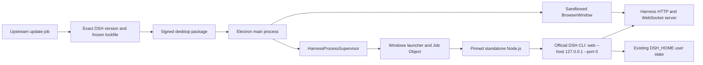

# Design for an upstream-compatible Windows desktop

English | [中文](design.zh.md)

## Verified baseline

| Area | Current implementation fact | Source |
| --- | --- | --- |
| Product entry | `dsh web` starts the current browser-facing product through the CLI profile and application bundle. | [CLI reference](../../../apps/cli/reference/README.md) and [web application bundle](../../../packages/bundle/web-app/src/index.ts) |
| Renderer boot | The Vite/React application expects an injected `window.__DSH_BOOT__` manifest and is therefore not a standalone static site. | [Vite configuration](../../../apps/web/vite.config.ts) and [web boot](../../../packages/client/web/src/boot.tsx) |
| Client modules | The host injects the module manifest, serves module bundles, and connects the browser client through HTTP and WebSocket APIs. | [client module registry](../../../packages/client/modules/src/index.ts) and [client connection](../../../packages/client/connection/src/client/index.ts) |
| Port selection | The web server accepts port `0`, so the operating system can allocate a free loopback port. | [web server host](../../../packages/host/webserver/src/index.ts) |
| Lifecycle | The CLI profile returns a shutdown function and installs bounded signal-driven cleanup for the mounted runtime. | [profile boot](../../../apps/cli/src/profile-boot.ts) and [process shutdown](../../../apps/cli/src/process-shutdown.ts) |
| Desktop boundary | Repository design notes reserve Electron IPC as a future transport but explicitly state that no desktop shell currently exists. | [GUI layering and RPC protocol note](../../../.agents/notes/implemented/architecture/2026-07-19-gui-layering-and-rpc-protocol.md) |

The production dependency closure includes native modules and executable assets. Loading that closure inside Electron would introduce Electron ABI rebuild and packaging risk, whereas running it under its own official Node.js runtime preserves the environment expected by the published CLI.

## Technology stack

| Layer | Current effective stack | Desktop addition |
| --- | --- | --- |
| Repository and language | TypeScript monorepo, pnpm workspace, and the root Node.js constraint `^22.19.0 || >=24.0.0`. | Separate TypeScript companion repository with its own release version and frozen dependency lock. |
| Product UI | React 18 application built by Vite 6 and booted from the host-injected module manifest. | Sandboxed Electron BrowserWindow; the React product remains upstream-owned. |
| Runtime | Published Node.js CLI with host modules, application bundles, native dependencies, and executable assets. | Pinned standalone Node.js distribution staged outside ASAR. |
| Transport | Loopback HTTP plus WebSocket client/server APIs. | Exact-origin Electron navigation and lifecycle supervision; no transport rewrite in the first release. |
| Windows lifecycle | No desktop host exists today. | Electron main process, desktop supervisor, and a small Job Object launcher. |
| Distribution | npm CLI release and browser launch. | Electron Forge installer, code signing, resource manifest, provenance, and clean-VM release gates. |

## Decision

Create a separate desktop companion repository. Electron owns only the window, desktop integration, release metadata, and supervision. A desktop-owned Windows launcher starts a pinned standalone Node.js runtime, which executes the exact lockfile-resolved official `@deepseek-ai/dsh` CLI in `web` mode.

The first release keeps the existing loopback HTTP and WebSocket boundary. This is a desktop product boundary, not a claim that the existing web implementation has become native UI. A true Electron IPC transport remains a later architectural option because it would require changes across boot-manifest generation, module bundle loading, client transport, streaming, file dialogs, and tests.

## Target architecture



| Component | Ownership | Responsibility |
| --- | --- | --- |
| Electron main process | Desktop companion | Single instance, window state, safe navigation, startup/error UI, application lifecycle, and version display. |
| `HarnessProcessSupervisor` | Desktop companion | Versioned interface that starts, probes, observes, and stops one Harness runtime without exposing process details to UI code. |
| Windows launcher | Desktop companion | Small signed helper that creates a Job Object, launches the Node.js process without a console, forwards standard streams, and guarantees descendant cleanup when its control channel or parent disappears. |
| Supervisor bootstrap | Desktop companion | Node.js `--import` module that translates a private control message into the CLI's existing signal-driven shutdown path without changing upstream source. |
| Node.js runtime | Pinned upstream binary | Executes the published DSH CLI and its native dependency closure independently of Electron's embedded Node.js ABI. |
| DeepSeek Harness | Official npm release | Supplies the existing CLI, host, web server, injected boot manifest, client bundles, and application behavior. |
| Renderer window | Existing Harness web client | Renders the product from the validated loopback URL with Node.js access disabled. |

## Desktop-owned supervisor interface

Window and packaging code depend only on the following conceptual interface. Exact TypeScript names may change during implementation, but the state transitions and failure semantics are required.

```ts
type HarnessState = 'idle' | 'starting' | 'ready' | 'stopping' | 'stopped' | 'failed'

interface SafeError {
  code: string
  message: string
}

interface ReadyInfo {
  origin: `http://127.0.0.1:${number}`
  desktopVersion: string
  harnessVersion: string
  nodeVersion: string
  buildId: string
}

interface HarnessProcessSupervisor {
  start(signal?: AbortSignal): Promise<ReadyInfo>
  stop(reason: 'window-close' | 'app-quit' | 'update' | 'failure'): Promise<void>
  state(): HarnessState
  onStateChange(listener: (state: HarnessState, error?: SafeError) => void): () => void
}
```

Only Electron's main process can call this interface. The BrowserWindow receives no process-control API, filesystem bridge, shell primitive, or generic IPC invocation surface.

## Runtime startup and shutdown

1. Electron acquires the single-instance lock and renders a packaged local startup page; it does not create a Harness window for a second instance.
2. The supervisor verifies the resource manifest, Node.js binary, CLI entry file, locked Harness version, and expected hashes before launch.
3. The launcher creates a Windows Job Object with kill-on-close semantics, starts the packaged `node.exe` with `shell: false`, an explicit working directory, hidden console settings, and the desktop-owned supervisor bootstrap in `--import`.
4. Node.js executes the resolved `@deepseek-ai/dsh` binary entry with `web --host 127.0.0.1 --port 0`. The desktop does not set `DSH_HOME` by default, so upstream `$DSH_HOME` or `~/.dsh` resolution remains intact; isolated tests set it explicitly.
5. The compatibility adapter recognizes the current CLI readiness line, rejects every origin except `http://127.0.0.1:<valid-port>`, and independently probes the root document for the expected boot manifest before returning `ready`.
6. Electron constructs the BrowserWindow only after readiness, loads the validated origin, and pins all subsequent in-app navigation to that exact origin.
7. Normal quit sends a private shutdown command through the launcher's control stream. The bootstrap waits for the CLI signal listener to exist, emits the existing shutdown event inside the Node.js process, and lets the upstream bounded cleanup path finish.
8. If graceful shutdown exceeds the desktop deadline, the launcher closes the Job Object and records a safe forced-cleanup diagnostic. Electron never sends a bare Windows `SIGTERM` and never assumes that killing one PID also cleans its descendants.
9. If Electron crashes or its control stream closes, the launcher closes the Job Object so the Harness process tree cannot remain orphaned.

The readiness-line parser and signal adapter are intentionally isolated compatibility code. Every exact Harness version bump must run contract tests against them; neither is treated as a permanent upstream API.

## Upstream version and release model

The desktop shell and Harness runtime have independent versions. A desktop release manifest records `desktopVersion`, exact `harnessVersion`, Node.js version, Electron version, build identifier, resource hashes, source repository, and package provenance.

The primary supply path is the official [`@deepseek-ai/dsh` npm package](https://www.npmjs.com/package/@deepseek-ai/dsh). The desktop dependency manifest uses an exact version rather than a range, and the committed lockfile freezes the full transitive graph. A source tag or commit build is allowed only when an official package is unavailable and must preserve the source revision, build recipe, hashes, and a clean-checkout attestation.

An upstream update follows one atomic review path:

1. The update job detects a new official version and opens a candidate change; it never publishes directly from a registry notification.
2. The candidate changes the exact Harness version, regenerates the frozen lockfile, refreshes the version manifest and notices, and records package integrity metadata.
3. CI installs from the lockfile, constructs the unpacked runtime closure, and runs supervisor contract, unit, packaged end-to-end, and clean-VM installer tests.
4. A signed candidate is promoted only after required evidence and human approval; the update must not mutate existing `$DSH_HOME` data outside upstream behavior.
5. The previous signed installer and manifest remain addressable. A failed candidate or post-release rollback restores the prior desktop package rather than rewriting or downgrading user data automatically.

The initial release uses signed installer upgrades. In-app automatic update is a separate future change after channel policy, signature verification, rollback, and active-session coordination have their own acceptance evidence.

## Optional minimal upstream contribution

The preferred long-term improvement is a small, versioned supervisor protocol in the CLI/application boundary, contributed upstream and consumed only after it is released officially. It would replace human-output parsing and the bootstrap's synthetic signal while retaining the same external process architecture.

The proposed contract emits a structured `ready` event containing the loopback origin on a dedicated inherited control channel, accepts a structured `shutdown` request, exits when the parent channel disappears, and reuses the existing `runProfile` shutdown function and bounded cleanup. Human logs stay on stdout and stderr, protocol messages are versioned, and unsupported messages fail explicitly.

This contribution must begin with a proposed Agent Note and upstream maintainer review. If it is rejected or delayed, the zero-source compatibility adapter remains the supported track. The desktop release must never apply an unreviewed local edit to the installed npm package; any temporary patch experiment lives outside the release path and a conflict fails the candidate update.

## Window and security design

The BrowserWindow follows Electron's [security checklist](https://www.electronjs.org/docs/latest/tutorial/security): `nodeIntegration` is disabled, context isolation and sandboxing are enabled, web security remains enabled, permissions default to denial, and no remote content receives desktop privileges.

The main process validates the exact loopback origin before `loadURL`, rejects navigation to other origins, denies unsolicited windows, and opens explicitly allowlisted external documentation links through the operating system browser only after scheme validation. The packaged startup and failure pages are static application resources with a restrictive content security policy.

No authentication token is placed in a URL, command line, renderer storage, or diagnostic bundle. Loopback exposure is reduced by random ephemeral port selection, exact-origin checks, short startup windows, and immediate runtime cleanup; if upstream later supplies a connection nonce, the desktop should adopt it through a separately reviewed compatibility change.

## Packaging design

Electron Forge produces a per-user Windows x64 installer and unpacked diagnostic artifact. Production publishing requires code signing. Enterprise MSI, Store packaging, and ARM64 are separate release targets.

`app.asar` contains desktop JavaScript and static startup/error UI only. The pinned Node.js runtime, Windows launcher, DSH production dependency tree, native modules, executable assets, licenses, notices, and release manifest are staged under Electron resources outside ASAR. This follows Electron's [application distribution](https://www.electronjs.org/docs/latest/tutorial/application-distribution) constraints and avoids loading Harness [native Node modules](https://www.electronjs.org/docs/latest/tutorial/using-native-node-modules) into Electron.

The packaging job assembles resources from a clean lockfile installation, rejects development-only dependencies, scans for missing executables and dynamic libraries, records hashes, signs final executables, and tests the installed path rather than only the development launcher.

## Development workflow

1. Keep the DeepSeek Harness checkout as a read-only upstream reference for desktop work; use it to verify behavior and run upstream tests, but do not place desktop implementation files or patched package contents in it.
2. Make desktop changes in the companion repository, where the exact Harness package, Node.js runtime, Electron toolchain, launcher source, and lockfile are reviewed together.
3. For local development, stage the same production dependency closure used by packaging, launch through the real supervisor, and use an explicit isolated `DSH_HOME` for automated tests; a development server shortcut cannot be the only verified path.
4. Before merging a desktop change, run formatting, lint, unit, launcher, supervisor, Electron security, and packaged E2E gates appropriate to the affected boundary, then inspect the generated resource manifest and dependency diff.
5. Treat a Harness version bump as a product change: update one exact version, regenerate the lock and provenance, run the complete compatibility matrix, review upstream release notes and source impact, and keep the candidate unpublished until approval.
6. Build release candidates only from clean, reviewed revisions in Windows CI, sign immutable artifacts, test installation and upgrade in clean virtual machines, and attach evidence to the matching stable task IDs.
7. Feed verified shipped behavior back into the current-state topic documentation and record architectural rationale in an accepted Agent Note; keep failed gates and residual risks in this change record.

## File impact

| Location | Planned impact |
| --- | --- |
| DeepSeek Harness current source | No runtime or application source change in the primary track; this change directory is the only current modification. |
| Desktop companion `package.json` and lockfile | Pin Electron tooling and the exact official DSH version; expose proposed build, test, package, and release scripts. |
| Desktop companion `src/main/` | Own application lifecycle, BrowserWindow policy, single-instance behavior, startup/error views, and version reporting. |
| Desktop companion `src/supervisor/` | Own the state machine, readiness validation, safe diagnostics, deadlines, and adapter interface. |
| Desktop companion `src/bootstrap/` | Own the zero-source Node.js control adapter and its version-contract tests. |
| Desktop companion `native/launcher/` | Own the Windows Job Object launcher, stream forwarding, console suppression, and descendant cleanup. |
| Desktop companion `scripts/` and `tests/` | Own runtime staging, manifest generation, signing checks, update automation, packaged E2E, clean-VM, and rollback evidence. |
| Optional upstream CLI/application files | Add only the approved versioned supervisor channel and tests after an Agent Note and maintainer acceptance. |
| Harness topic documentation | Update current-state architecture, development, and subsystem pages only when verified implementation ships. |

## Failure semantics

| Failure | Required behavior |
| --- | --- |
| Package integrity or resource hash mismatch | Abort before process launch, show a tamper-safe installation error, and provide reinstall guidance. |
| Node.js or CLI entry missing | Abort startup with the exact missing component and safe log location; never fall back to an arbitrary system Node.js. |
| Harness exits before readiness | Capture bounded redacted output, transition to `failed`, offer retry or exit, and close the Job Object. |
| Readiness timeout or malformed origin | Reject the origin, stop the process tree, and display a protocol compatibility error tied to the exact Harness version. |
| Loopback probe or boot manifest mismatch | Do not create the product window; stop the candidate runtime and mark the build or update incompatible. |
| Renderer crash | Recreate the window only under a bounded retry policy while preserving the one supervised runtime; repeated failure stops the runtime. |
| Harness exits after readiness | Replace the product view with a local failure page, preserve safe diagnostics, and require explicit restart. |
| Graceful shutdown timeout | Record the timeout, terminate the Job Object, verify no descendants remain, and exit nonzero in automated tests. |
| Electron or launcher crash | Job Object ownership closes and kills the runtime tree; the next launch reports the previous abnormal termination without secrets. |
| Upstream update gate failure | Keep the last known-good signed release active, retain candidate evidence, and block promotion. |
| User-state incompatibility | Stop promotion and require an explicit upstream-compatible migration and backup plan; never silently rewrite or downgrade `$DSH_HOME`. |
| Signing or release scan failure | Produce no production release and retain only internal diagnostic artifacts. |

## Validation strategy

| Layer | Required validation |
| --- | --- |
| Documentation | Translation-pair verification, relative-link checks, prose validation, `pnpm run doc-sync`, lint where dependencies are available, and `git diff --check`. |
| Supervisor unit | State transitions, readiness parsing, origin rejection, redaction, deadlines, cancellation, repeated start/stop, and version manifest validation. |
| Launcher integration | Hidden launch, Job Object assignment, control-stream EOF, graceful stop, forced timeout, parent crash, descendant process cleanup, and paths containing spaces or non-ASCII characters. |
| Harness compatibility | Exact-version CLI launch, boot-manifest probe, session creation, HTTP and WebSocket streaming, reload, `$DSH_HOME` persistence, and native dependency execution. |
| Electron security | Configuration assertions, navigation and popup denial, permission denial, external-link allowlist, preload absence or minimal surface, and renderer crash recovery. |
| Packaging | ASAR boundary inspection, production dependency closure, binary and notice inventory, resource hashes, executable signatures, installer install/uninstall, and no system Node.js dependency. |
| Release | Windows 10 and Windows 11 x64 clean-VM smoke tests, upgrade from the previous release, failed-candidate rehearsal, rollback availability, antivirus scan, and artifact provenance. |

Proposed companion-repository commands such as `pnpm test`, `pnpm test:e2e:packaged`, `pnpm package:win`, and `pnpm verify:release` become binding only when their scripts are implemented and documented there. This plan does not claim that those commands exist today.

## Alternatives considered

| Alternative | Decision |
| --- | --- |
| Electron main process loads Harness directly | Rejected for the first release because Electron ABI rebuilds, native modules, process isolation, and upstream dependency churn would become desktop-shell concerns. |
| Tauri shell | Deferred because it adds a Rust and WebView2 packaging toolchain without removing the need to ship and supervise the Node.js Harness runtime. |
| True Electron IPC transport | Deferred because it is a cross-layer Harness feature rather than a minimal packaging change. |
| Native Windows UI rewrite | Rejected because it duplicates the product UI and would make upstream feature updates expensive and slow. |
| Progressive Web App or browser shortcut | Rejected because it does not provide the required owned installer, process lifecycle, versioned runtime, diagnostics, and clean rollback. |
| Long-lived Harness fork | Rejected because it directly conflicts with the upstream-following objective and turns every upstream release into a merge project. |
