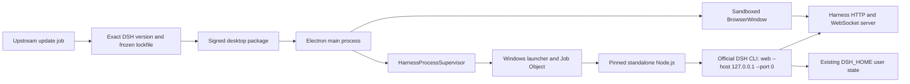

# 上游兼容 Windows 桌面应用设计

[English](design.md) | 中文

## 已验证基线

| 领域 | 当前实现事实 | 来源 |
| --- | --- | --- |
| 产品入口 | `dsh web` 通过 CLI profile 和应用 bundle 启动当前面向浏览器的产品。 | [CLI 参考](../../../apps/cli/reference/README.md) 和 [Web 应用 bundle](../../../packages/bundle/web-app/src/index.ts) |
| 渲染进程启动 | Vite/React 应用依赖注入的 `window.__DSH_BOOT__` 清单，因此它不是独立静态站点。 | [Vite 配置](../../../apps/web/vite.config.ts) 和 [Web 启动](../../../packages/client/web/src/boot.tsx) |
| 客户端模块 | host 注入模块清单、提供模块 bundle，并通过 HTTP 和 WebSocket API 连接浏览器客户端。 | [客户端模块注册表](../../../packages/client/modules/src/index.ts) 和 [客户端连接](../../../packages/client/connection/src/client/index.ts) |
| 端口选择 | Web 服务器接受端口 `0`，因此操作系统可以分配空闲环回端口。 | [Web 服务器 host](../../../packages/host/webserver/src/index.ts) |
| 生命周期 | CLI profile 返回关闭函数，并为已挂载运行时安装有界的信号驱动清理。 | [profile 启动](../../../apps/cli/src/profile-boot.ts) 和 [进程关闭](../../../apps/cli/src/process-shutdown.ts) |
| 桌面边界 | 仓库设计说明把 Electron IPC 保留为未来传输方式，同时明确指出当前不存在桌面外壳。 | [GUI 分层与 RPC 协议说明](../../../.agents/notes/implemented/architecture/2026-07-19-gui-layering-and-rpc-protocol.md) |

生产依赖闭包包含原生模块和可执行资源。在 Electron 内加载该闭包会引入 Electron ABI 重建和打包风险，而在独立官方 Node.js 运行时下运行它，可以保留已发布 CLI 所期望的环境。

## 技术栈

| 层次 | 当前有效技术栈 | 桌面新增部分 |
| --- | --- | --- |
| 仓库与语言 | TypeScript monorepo、pnpm workspace，以及根 Node.js 约束 `^22.19.0 || >=24.0.0`。 | 具有独立发布版本和冻结依赖锁的 TypeScript 伴生仓库。 |
| 产品 UI | 由 Vite 6 构建、从 host 注入模块清单启动的 React 18 应用。 | 沙箱化 Electron BrowserWindow；React 产品仍归上游所有。 |
| 运行时 | 已发布的 Node.js CLI，包含 host 模块、应用 bundle、原生依赖和可执行资源。 | 在 ASAR 外暂存的固定独立 Node.js 发行物。 |
| 传输 | 环回 HTTP 加 WebSocket 客户端/服务器 API。 | Electron 精确来源导航和生命周期监管；首个版本不重写传输。 |
| Windows 生命周期 | 当前不存在桌面 host。 | Electron 主进程、桌面监管器和小型 Job Object 启动器。 |
| 分发 | npm CLI 发布物和浏览器启动。 | Electron Forge 安装器、代码签名、资源清单、来源和干净虚拟机发布门禁。 |

## 决策

创建独立桌面伴生仓库。Electron 仅负责窗口、桌面集成、发布元数据和监管。桌面自有的 Windows 启动器启动固定版本的独立 Node.js 运行时，由它执行锁文件精确解析出的官方 `@deepseek-ai/dsh` CLI，并使用 `web` 模式。

首个版本保留现有环回 HTTP 和 WebSocket 边界。这是桌面产品边界，并不表示现有 Web 实现已成为原生 UI。真正的 Electron IPC 传输仍是后续架构选项，因为它需要跨越启动清单生成、模块 bundle 加载、客户端传输、流式处理、文件对话框和测试等多个层面进行修改。

## 目标架构



| 组件 | 归属 | 职责 |
| --- | --- | --- |
| Electron 主进程 | 桌面伴生项目 | 负责单实例、窗口状态、安全导航、启动与错误 UI、应用生命周期和版本展示。 |
| `HarnessProcessSupervisor` | 桌面伴生项目 | 提供版本化接口，启动、探测、观察和停止一个 Harness 运行时，并避免 UI 代码接触进程细节。 |
| Windows 启动器 | 桌面伴生项目 | 小型签名辅助程序，负责创建 Job Object、无控制台启动 Node.js 进程、转发标准流，并在控制通道或父进程消失时保证清理后代进程。 |
| 监管 bootstrap | 桌面伴生项目 | Node.js `--import` 模块，在不修改上游源码的情况下，把私有控制消息转换为 CLI 现有的信号驱动关闭路径。 |
| Node.js 运行时 | 固定的上游二进制 | 独立于 Electron 内置 Node.js ABI，执行已发布 DSH CLI 及其原生依赖闭包。 |
| DeepSeek Harness | 官方 npm 发布物 | 提供现有 CLI、host、Web 服务器、注入的启动清单、客户端 bundle 和应用行为。 |
| 渲染窗口 | 现有 Harness Web 客户端 | 在禁用 Node.js 访问的前提下，从已验证的环回 URL 渲染产品。 |

## 桌面自有监管接口

窗口和打包代码仅依赖以下概念接口。具体 TypeScript 名称可以在实施期间调整，但状态转换和失败语义是必需约束。

```ts
type HarnessState = 'idle' | 'starting' | 'ready' | 'stopping' | 'stopped' | 'failed'

interface SafeError {
  code: string
  message: string
}

interface ReadyInfo {
  origin: `http://127.0.0.1:${number}`
  desktopVersion: string
  harnessVersion: string
  nodeVersion: string
  buildId: string
}

interface HarnessProcessSupervisor {
  start(signal?: AbortSignal): Promise<ReadyInfo>
  stop(reason: 'window-close' | 'app-quit' | 'update' | 'failure'): Promise<void>
  state(): HarnessState
  onStateChange(listener: (state: HarnessState, error?: SafeError) => void): () => void
}
```

只有 Electron 主进程可以调用此接口。BrowserWindow 不接收任何进程控制 API、文件系统桥接、shell 原语或通用 IPC 调用面。

## 运行时启动与关闭

1. Electron 获取单实例锁并呈现打包的本地启动页；第二个实例不会创建 Harness 窗口。
2. 监管器在启动前验证资源清单、Node.js 二进制、CLI 入口文件、锁定的 Harness 版本和预期哈希。
3. 启动器创建具有关闭即终止语义的 Windows Job Object，并通过 `shell: false`、明确工作目录、隐藏控制台设置和 `--import` 中的桌面自有监管 bootstrap 启动打包的 `node.exe`。
4. Node.js 使用 `web --host 127.0.0.1 --port 0` 执行解析出的 `@deepseek-ai/dsh` 二进制入口。桌面默认不设置 `DSH_HOME`，因此保留上游 `$DSH_HOME` 或 `~/.dsh` 解析；隔离测试会显式设置它。
5. 兼容性适配器识别当前 CLI 就绪行，拒绝除 `http://127.0.0.1:<valid-port>` 以外的所有来源，并独立探测根文档是否含有预期启动清单，然后才返回 `ready`。
6. Electron 仅在就绪后创建 BrowserWindow、加载已验证来源，并把此后的应用内导航固定到该精确来源。
7. 正常退出通过启动器控制流发送私有关闭命令。bootstrap 等待 CLI 信号监听器存在，在 Node.js 进程内部触发现有关闭事件，并让上游有界清理路径完成。
8. 如果优雅关闭超过桌面截止时间，启动器关闭 Job Object，并记录安全的强制清理诊断。Electron 绝不发送裸 Windows `SIGTERM`，也不假设终止一个 PID 会一并清理其后代。
9. 如果 Electron 崩溃或其控制流关闭，启动器关闭 Job Object，使 Harness 进程树不能成为孤儿。

就绪行解析器和信号适配器是有意隔离的兼容性代码。每次精确 Harness 版本升级都必须针对它们运行契约测试；两者都不被视为永久上游 API。

## 上游版本与发布模型

桌面外壳和 Harness 运行时具有独立版本。桌面发布清单记录 `desktopVersion`、精确 `harnessVersion`、Node.js 版本、Electron 版本、构建标识、资源哈希、源码仓库和包来源。

主要供应路径是官方 [`@deepseek-ai/dsh` npm 包](https://www.npmjs.com/package/@deepseek-ai/dsh)。桌面依赖清单使用精确版本而不是范围，已提交锁文件冻结完整传递依赖图。只有在官方包不可用时才允许从源码标签或提交构建，并且必须保留源码修订、构建步骤、哈希和干净检出证明。

上游更新遵循一条原子化评审路径：

1. 更新任务检测新的官方版本并创建候选变更；它绝不因注册表通知而直接发布。
2. 候选变更修改精确 Harness 版本、重新生成冻结锁文件、刷新版本清单和声明，并记录包完整性元数据。
3. CI 从锁文件安装、构造解包后的运行时闭包，并运行监管器契约、单元、打包端到端和干净虚拟机安装器测试。
4. 只有具备必需证据和人工批准后才提升签名候选；更新不得在上游行为之外改变现有 `$DSH_HOME` 数据。
5. 上一个签名安装器和清单保持可访问。候选失败或发布后回滚时恢复上一桌面包，而不是自动重写或降级用户数据。

首个版本使用签名安装器升级。应用内自动更新属于独立的后续变更，需要为通道策略、签名验证、回滚和活动会话协调分别提供验收证据。

## 可选的极小上游贡献

推荐的长期改进是在 CLI/应用边界加入小型、版本化的监管协议，将其贡献到上游，并仅在正式发布后使用。它会替换人工输出解析和 bootstrap 合成信号，同时保留相同的外部进程架构。

拟议契约在专用继承控制通道上发出包含环回来源的结构化 `ready` 事件，接受结构化 `shutdown` 请求，在父通道消失时退出，并复用现有 `runProfile` 关闭函数和有界清理。人工日志仍使用 stdout 和 stderr，协议消息带版本，不支持的消息明确失败。

此贡献必须从 proposed Agent Note 和上游维护者评审开始。如果它被拒绝或延迟，零源码兼容性适配器仍是受支持路线。桌面发布绝不对已安装 npm 包应用未经评审的本地修改；任何临时补丁实验都位于发布路径之外，并在冲突时使候选更新失败。

## 窗口与安全设计

BrowserWindow 遵循 Electron [安全检查清单](https://www.electronjs.org/docs/latest/tutorial/security)：禁用 `nodeIntegration`、启用上下文隔离和沙箱、保持 Web 安全开启、权限默认拒绝，并且不向远程内容授予桌面权限。

主进程在 `loadURL` 前验证精确环回来源，拒绝导航到其他来源、拒绝非请求窗口，并只在验证 scheme 后通过操作系统浏览器打开明确允许的外部文档链接。打包的启动页和故障页是应用静态资源，使用严格的内容安全策略。

身份验证令牌不得放在 URL、命令行、渲染进程存储或诊断包中。通过随机临时端口、精确来源检查、短启动窗口和立即清理运行时来降低环回暴露；如果上游后续提供连接 nonce，桌面应通过独立评审的兼容性变更采用它。

## 打包设计

Electron Forge 生成按用户安装的 Windows x64 安装器和解包诊断产物。生产发布必须进行代码签名。企业 MSI、Store 打包和 ARM64 是独立发布目标。

`app.asar` 仅包含桌面 JavaScript 和静态启动/错误 UI。固定的 Node.js 运行时、Windows 启动器、DSH 生产依赖树、原生模块、可执行资源、许可证、声明和发布清单都位于 Electron resources 下的 ASAR 外。这符合 Electron [应用分发](https://www.electronjs.org/docs/latest/tutorial/application-distribution) 约束，并避免在 Electron 中加载 Harness [原生 Node 模块](https://www.electronjs.org/docs/latest/tutorial/using-native-node-modules)。

打包任务从干净锁文件安装中组装资源，拒绝仅开发依赖，扫描缺失的可执行文件和动态库，记录哈希，对最终可执行文件签名，并测试已安装路径而不仅是开发启动器。

## 开发流程

1. 在桌面工作中把 DeepSeek Harness 检出保持为只读上游参考；用它验证行为并运行上游测试，但不在其中放置桌面实施文件或修补后的包内容。
2. 在伴生仓库中进行桌面变更，把精确 Harness 包、Node.js 运行时、Electron 工具链、启动器源码和锁文件一起评审。
3. 本地开发时暂存与打包相同的生产依赖闭包，通过真实监管器启动，并为自动化测试使用明确隔离的 `DSH_HOME`；不能只验证开发服务器快捷路径。
4. 合并桌面变更前，根据受影响边界运行格式化、lint、单元、启动器、监管器、Electron 安全和打包 E2E 门禁，然后检查生成的资源清单和依赖差异。
5. 把 Harness 版本升级视为产品变更：一次只更新一个精确版本、重新生成锁和来源、运行完整兼容性矩阵、评审上游发布说明和源码影响，并在批准前保持候选未发布。
6. 仅从 Windows CI 中干净且已评审的修订构建发布候选，对不可变产物签名，在干净虚拟机中测试安装与升级，并把证据附加到匹配的稳定任务 ID。
7. 把已验证交付行为反馈到当前状态主题文档，并在已接受 Agent Note 中记录架构理由；失败门禁和残余风险保留在本变更记录中。

## 文件影响

| 位置 | 计划影响 |
| --- | --- |
| DeepSeek Harness 当前源码 | 主路线不修改运行时或应用源码；本变更目录是当前唯一修改。 |
| 桌面伴生项目 `package.json` 和锁文件 | 固定 Electron 工具和精确官方 DSH 版本；提供拟议的构建、测试、打包和发布脚本。 |
| 桌面伴生项目 `src/main/` | 负责应用生命周期、BrowserWindow 策略、单实例行为、启动与错误视图和版本展示。 |
| 桌面伴生项目 `src/supervisor/` | 负责状态机、就绪验证、安全诊断、截止时间和适配器接口。 |
| 桌面伴生项目 `src/bootstrap/` | 负责零源码 Node.js 控制适配器及其版本契约测试。 |
| 桌面伴生项目 `native/launcher/` | 负责 Windows Job Object 启动器、流转发、控制台隐藏和后代清理。 |
| 桌面伴生项目 `scripts/` 和 `tests/` | 负责运行时暂存、清单生成、签名检查、更新自动化、打包 E2E、干净虚拟机和回滚证据。 |
| 可选上游 CLI/应用文件 | 仅在 Agent Note 和维护者接受后，添加已批准的版本化监管通道和测试。 |
| Harness 主题文档 | 仅在已验证实施交付后更新当前状态架构、开发和子系统页面。 |

## 失败语义

| 失败 | 必需行为 |
| --- | --- |
| 包完整性或资源哈希不匹配 | 在进程启动前中止，显示防篡改安装错误，并提供重新安装指引。 |
| 缺少 Node.js 或 CLI 入口 | 使用精确的缺失组件和安全日志位置中止启动；绝不回退到任意系统 Node.js。 |
| Harness 在就绪前退出 | 捕获有界且已隐去敏感信息的输出，转换到 `failed`，提供重试或退出，并关闭 Job Object。 |
| 就绪超时或来源格式错误 | 拒绝来源、停止进程树，并显示与精确 Harness 版本关联的协议兼容性错误。 |
| 环回探测或启动清单不匹配 | 不创建产品窗口；停止候选运行时，并将构建或更新标记为不兼容。 |
| 渲染进程崩溃 | 仅在有界重试策略下重建窗口，并保留唯一受监管运行时；重复失败时停止运行时。 |
| Harness 在就绪后退出 | 用本地故障页替换产品视图、保留安全诊断，并要求显式重启。 |
| 优雅关闭超时 | 记录超时、终止 Job Object、验证无后代遗留，并在自动化测试中以非零状态退出。 |
| Electron 或启动器崩溃 | Job Object 所有权关闭并终止运行时树；下次启动报告上一次异常终止，但不包含秘密。 |
| 上游更新门禁失败 | 保持最后一个已知良好签名版本有效、保留候选证据，并阻止提升。 |
| 用户状态不兼容 | 停止提升并要求明确的上游兼容迁移和备份计划；绝不静默重写或降级 `$DSH_HOME`。 |
| 签名或发布扫描失败 | 不生成生产发布，只保留内部诊断产物。 |

## 验证策略

| 层次 | 必需验证 |
| --- | --- |
| 文档 | 翻译配对验证、相对链接检查、prose 验证、`pnpm run doc-sync`、依赖可用时运行 lint，以及 `git diff --check`。 |
| 监管器单元测试 | 状态转换、就绪解析、来源拒绝、敏感信息隐去、截止时间、取消、重复启停和版本清单验证。 |
| 启动器集成 | 隐藏启动、Job Object 分配、控制流 EOF、优雅停止、强制超时、父进程崩溃、后代进程清理，以及含空格或非 ASCII 字符的路径。 |
| Harness 兼容性 | 精确版本 CLI 启动、启动清单探测、会话创建、HTTP 和 WebSocket 流式响应、重新加载、`$DSH_HOME` 持久化和原生依赖执行。 |
| Electron 安全 | 配置断言、导航与弹窗拒绝、权限拒绝、外部链接允许列表、无 preload 或最小接口，以及渲染进程崩溃恢复。 |
| 打包 | ASAR 边界检查、生产依赖闭包、二进制与声明清单、资源哈希、可执行文件签名、安装器安装/卸载，以及不依赖系统 Node.js。 |
| 发布 | Windows 10 和 Windows 11 x64 干净虚拟机冒烟、从上一版本升级、失败候选演练、回滚可用性、杀毒扫描和产物来源。 |

拟议伴生仓库中的 `pnpm test`、`pnpm test:e2e:packaged`、`pnpm package:win` 和 `pnpm verify:release` 等命令，只有在相应脚本已经实现并在该仓库记录后才成为约束。本计划不声称这些命令当前已经存在。

## 已考虑的替代方案

| 替代方案 | 决策 |
| --- | --- |
| Electron 主进程直接加载 Harness | 首个版本拒绝，因为 Electron ABI 重建、原生模块、进程隔离和上游依赖变化都会成为桌面外壳的负担。 |
| Tauri 外壳 | 延后，因为它增加 Rust 和 WebView2 打包工具链，却不能消除交付和监管 Node.js Harness 运行时的需要。 |
| 真正的 Electron IPC 传输 | 延后，因为它是跨层 Harness 功能，而不是极小打包变更。 |
| 原生 Windows UI 重写 | 拒绝，因为它会重复产品 UI，并使上游功能更新昂贵且缓慢。 |
| 渐进式 Web 应用或浏览器快捷方式 | 拒绝，因为它无法提供所需的自有安装器、进程生命周期、版本化运行时、诊断和干净回滚。 |
| 长期 Harness 分叉 | 拒绝，因为它直接违背跟随上游的目标，并会把每次上游发布都变成合并项目。 |
